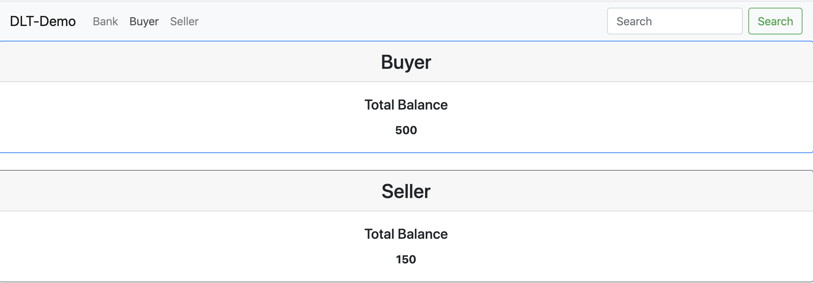

## Repo Description
This repo is used to run a frontend app based on ReactJS that can interact with my [Fabric repo](https://github.com/yunxi-zhang/Fabric) or [ABS-Quorum repo](https://github.com/yunxi-zhang/ABS-Quorum) operating as a backend app along with a Fabric DLT network. Together, the two repos run as a simple DLT demo.

## Prerequisites
1. OS: MacOS 10.14.6 (properly tested) or Unix/Linux(not properly tested yet).
2. node version: 10.17.0.
3. Azure App Service Insight, this dependency can be removed if the appServiceInsight file is commented out.
4. A ".env" file needs to be created in the root path of this repo to include environmental variables.
```
PORT={A Port number} (optional)
REACT_APP_API_MANAGEMENT_ENABLED={true/false} (mandatory)
REACT_APP_API_MANAGEMENT_SUBSCRIPTION_KEY={Azuree API management subscription key} (optional if the value for REACT_APP_API_MANAGEMENT_ENABLED is set to false; otherwise mandatory)
REACT_APP_BANK_API_HOSTNAME={http/https protocol + hostname of the bank service} (mandatory)
REACT_APP_BANK_API_PORT={port number of the bank service} (mandatory)
REACT_APP_BUYER_API_HOSTNAME={http/https protocol + hostname of the buyer service} (mandatory)
REACT_APP_BUYER_API_PORT={port number of the buyer service} (mandatory)
REACT_APP_SELLER_API_HOSTNAME={http/https protocol + hostname of the seller service} (mandatory)
REACT_APP_SELLER_API_PORT={port number of the seller service} (mandatory)
REACT_APP_APPINSIGHTS_KEY={An Azure App Service Insight Key} (optional, but needs to follow an action on prereq 3)
```

An example of .env file is shown below assuming all the bank, buyer and seller services are running in a local machine. 
```
PORT=3000
REACT_APP_API_MANAGEMENT_ENABLED=false
REACT_APP_BANK_API_HOSTNAME=http://localhost
REACT_APP_BANK_API_PORT=3001
REACT_APP_BUYER_API_HOSTNAME=http://localhost
REACT_APP_BUYER_API_PORT=3002
REACT_APP_SELLER_API_HOSTNAME=http://localhost
REACT_APP_SELLER_API_PORT=3003
```

## Approach 1: Run This App
1. <b>Option 1</b>: Run the following script to auto run the app
```
./runApp.sh
```

2. <b>Option 2</b>: If the shell script is not supported in the machine, run the following command to install dependencies,
```
npm install
```

then run the following command to run this DLT-Demo
```
npm start
```

## Approach 2: Run This App as A Docker Container
Tested on: Docker Community version - 2.3.0.4(46911) with Docker engine: 19.03.12<br>  
1. <b>Option 1</b>: Run the following script to auto run this app by using a docker compose file. The docker compose file will pull a pre-built docker image from the docker hub. This docker image includes files to use Azure appServiceInsight.
```
./useRemoteDockerImage.sh
```

2. <b>Option 2</b>: Run the following script to run this app to build a docker image locally and run a docker container based on this docker image. 
```
./useLocalDockerImage.sh
```
This gives a user flexibility to exclude or remove any files that are not necessary. For instance, <br> (1) the folder "appServiceInsight" in the /src/components can be removed before a local docker image is to be built. <br> 
(2) below code in the "Bank.js" file in the /src/components/bank can be removed.
```
      appInsights.trackEvent({
        name: 'bank data'
      });
```

## How A Landing Page Looks like
By default, this front-end app runs on port number 3000 in a local machine. Below shows a portal page.
